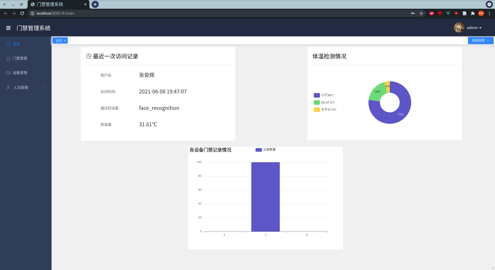
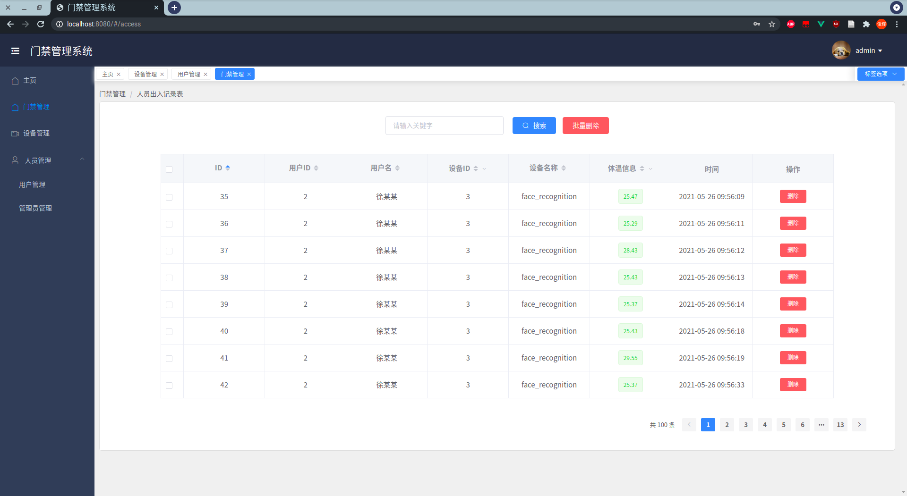
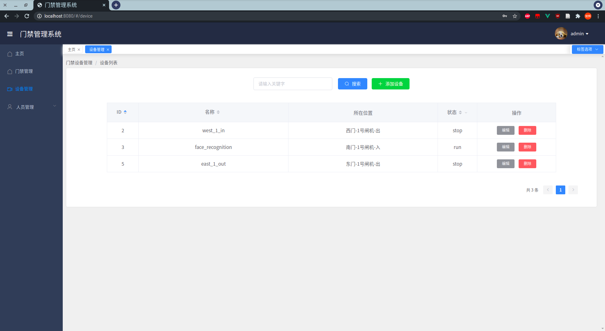
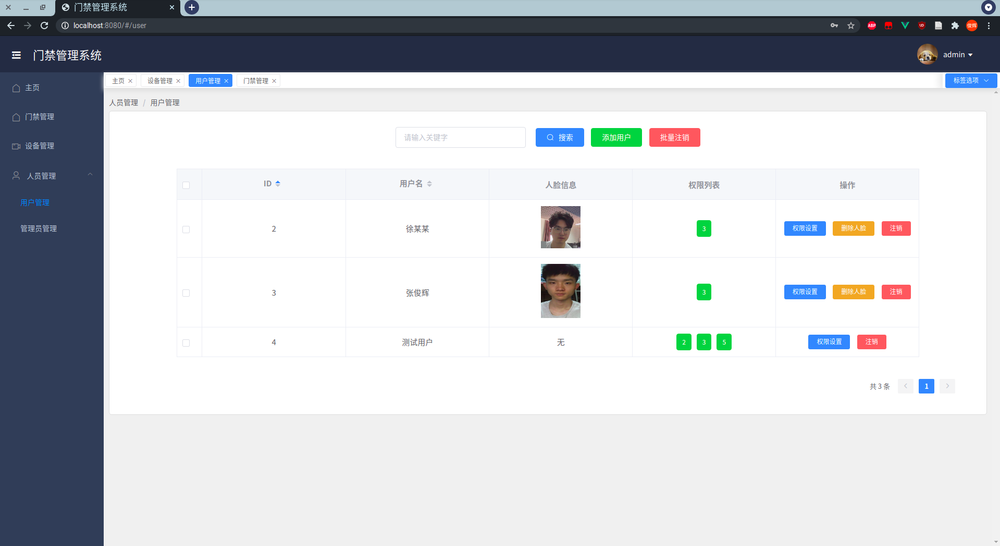
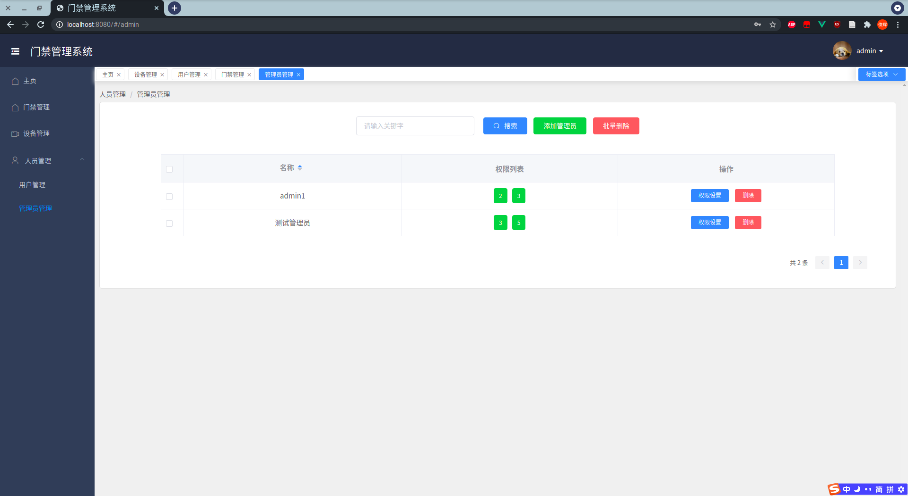
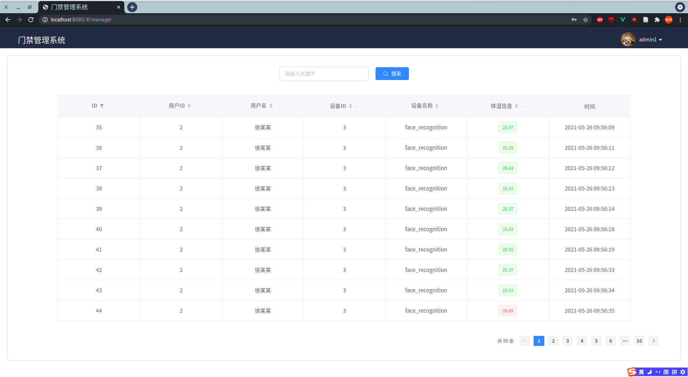

# Access Control System

一个基于SpringBoot+MyBatis+Vue+Element的门禁管理系统。

1. 系统用户分为超级管理员和普通管理员
2. 系统功能包括门禁记录管理、门禁设备管理和人员管理
3. 系统是人脸识别门禁闸机系统之上的管理系统

## 运行演示

1. 登录页面

2.  主页

3. 门禁管理页面

4. 设备管理页面

5. 人员管理页面

6. 普通管理页面

